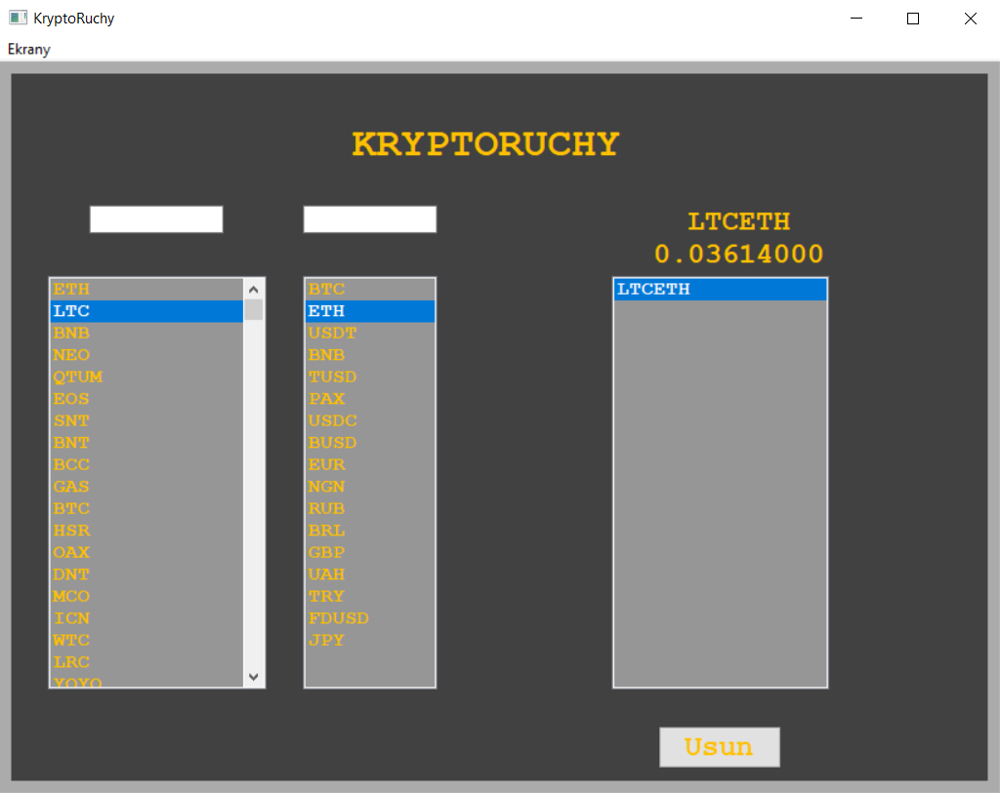
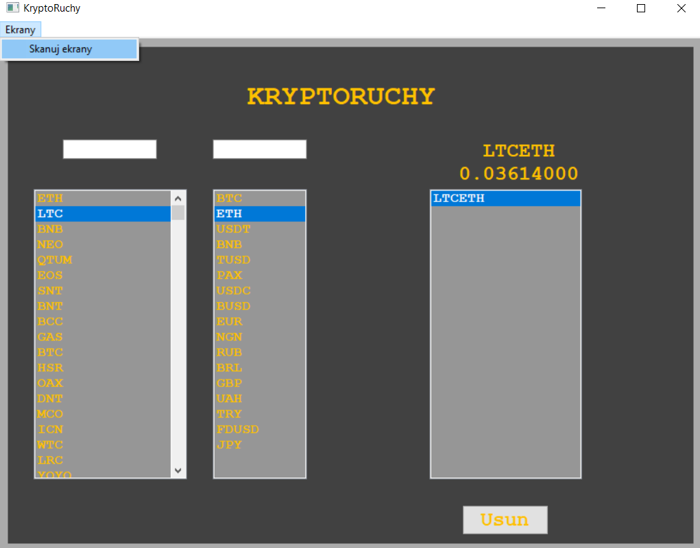

# Crypto_Display
Aplikacja pozwala śledzić w czasie rzeczywistym rynkowe wartości kryptowalut w przeliczeniu na wiele walut, czy inne kryptowaluty. Użytkownik tworzy zbiór konfiguracji które go interesują i z niego może wybierać która będzie wyświetlana. Dane są pobierane z web api https://api.binance.com, a więc dostępne są takie konfiguracje na jakie api pozwala. Najważniejszą funkcjonalnością aplikacji jest jednak możliwość przesyłania tych aktualnych **informacji na zewnętrzny ekran** poprzez Bluetooth, dodatkowo umożliwia **sterowanie zbiorem konfiguracji zdalnie przez pilot** na podczerwień. 

## Jak korzystać
- Uruchamiasz program na komputerze z dostępem do Internetu.
- W kolumnie po lewej stronie wybierasz kryptowalutę którą chcesz dodać do kolekcji, możesz posłużyć się polem wyszukiwania umieszczonym nad kolumną. W programie posługujemy się skrótowymi nazwami.
- Następnie po zaktualizowaniu się drugiej kolumny, w podobny sposób wybierasz walutę w której zostanie przedstawiona wartość kryptowaluty.
- Natychmiastowo twoja konfiguracja zostanie dodana do kolekcji znajdującej się po prawej stronie okna, oraz zostanie mianowana aktualnie wyświetlaną.
- Możesz dodawać w ten sposób wiele konfiguracji i wybierać z kolejki która ma być wyświetlana.
- Z kolejki usuwasz aktualnie wybrany element przyciskiem Usuń znajdującym się pod polem kolejki.

### Jeśli posiadasz dedykowany ekran
- Na pasku w górnym menu wybierasz opcję Ekrany
- W rozwiniętym menu u samej góry znajduje się przycisk skanowania, zanim go naciśniesz upewnij się że masz aktualnie włączony Bluetooth na urząrzeniu.
- Po kilki sekundach pod przyciskiem skanowania wyświetlą się nazwy znalezionych w pobliżu urządzeń.
- Wybierz jeden ze znalezionych ekranów z listy, a automatycznie z lekkim opóźnieniem rozpocznie się wyświetlanie danych na ekranie.
- Po podłączeniu ukranu możesz przełączać w dół lub górę kolejki aktualnie wybraną konfigurację korzystając z przycisków podgłaśniania i ściszania.
- Pilo pozwala także na usuwanie aktualnie wybranej konfiguracji przyciskiem play/stop.
- Pamiętaj by zawsze mieć pilot skierowany w stronę diody, wystającej obok ekranu.

## Wykorzystane biblioteki niestandardowe
**wxWidgets** - do graficznej prezentacji

**winrt** - do obsługi urządzeń Bluetooth na urządzeniach z systemem Windows

**curl** - do komunikacji z api

**nlohmann_json** - do dekodowania i kodowania pakietów JSON

## Ekran oraz kontroler
Wykonane zostały w oparciu o płytkę Arduino Nano 33BLE, a więc oprogramowanie zostało wykonane w programie Arduino IDE korzystając z specyficznej wersji języka C++. Nie umieszam go tutaj, ponieważ głównie składa się z fragmentów uzyskanych z dokumentacji bibliotek.
